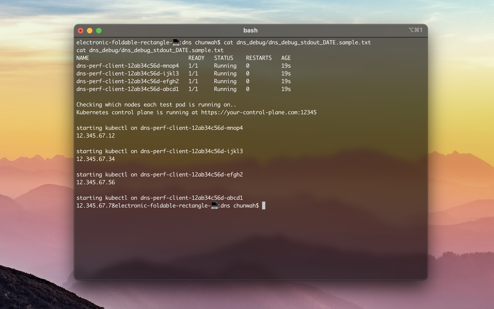

<h1 align="center">
  <br>
  
  <br>
  DevOps DNS Debug Script
  <br>
</h1>

<h4 align="center">A set of scripts to run alongside <a href="https://github.com/kubernetes/perf-tests/tree/master/dns" target="_blank">Kubernetes DNS Performance Test</a>.</h4>

<p align="center">
  <a href="#motivation">Motivation</a> •
  <a href="#key-features">Key Features</a> •
  <a href="#usage">Usage</a> •
  <a href="#stack">Stack</a> •
  <a href="#resources">Resources</a>
</p>



## Motivation
My DevOps team needed higher visibility over our DNS configuration.

## Key Features
* Get the node a dns-perf-client pod is running on
  - This was initially to check our starvation theory
* Run dig on all dns pods
  - This was to check the ANSWER SECTION during our initial investigation
* Export all db tables to csv via script 
  - This is mainly for graphing the round trip time (in milliseconds) for each test run
* Get LogDNA node name
  - This was initially to cross-reference the logs in LogDNA and in-cluster nodes that we were investigating


## Usage


```bash
# Clone this repository
$ git clone https://github.com/chunwahchung/dns-debug.git

# Go into the repository
$ cd dns-debug

# Run script
$ ./dns_debug/dns_debug.sh 2>&1 | tee dns_debug/dns_debug_stdout_$(date +%m-%d-%Y-%T-%Z).txt
```

_Note_: The version of bash I'm running is GNU bash, version 3.2.57(1)-release (x86_64-apple-darwin20)


## Extra
### Hosts List File
The lists of hosts to query needs to be in dnsperf format.

_Example_:
```
svc1.svc.cluster.local A
svc1.svc.cluster.local AAAA
svc1.default.svc.cluster.local A
svc1.default.svc.cluster.local AAAA
google.com.svc.cluster.local A
google.com.svc.cluster.local AAAA
```
### CoreDNS Pod QPS
If you have the prometheus plugin configured in your CoreDNS Corefile, you can view metrics from CoreDNS. By default you can find metrics on the dns pods at `localhost:9153`
```
Corefile:
----
.:53 {
    
    other server block config...

    prometheus :9153

    other server block config...
}
```
## Stack

- Kubernetes
- CoreDNS
- OpenShift DNS Operator
- Bash
- Python
- sqlite3
- PromQL

## Resources
- [OpenShift DNS Operator](https://docs.openshift.com/container-platform/4.7/networking/dns-operator.html)
- [CoreDNS](https://coredns.io/manual/toc/)
- [Kubernetes DNS Performance Test](https://github.com/kubernetes/perf-tests/tree/master/dns)
- [dnsperf](https://github.com/DNSPerf/dnsperf)

---

> My Website [chunwahchung.me](https://www.chunwahchung.me) &nbsp;&middot;&nbsp;
> LinkedIn [chunwahchung](https://www.linkedin.com/in/chunwahchung/)

